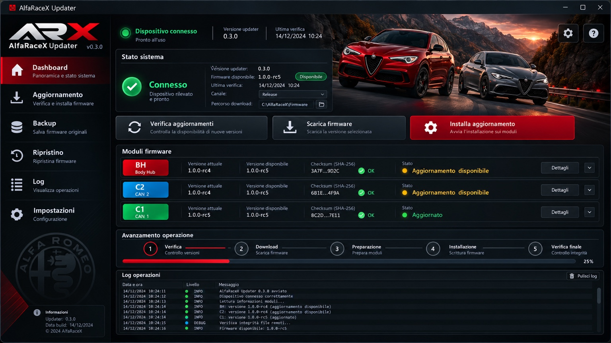

# AlfaRaceX

**AlfaRaceX (ARX)** is a modular embedded framework for CAN/UDS research, diagnostics,
telemetry and feature development on Alfa Romeo Giulia and Stelvio vehicles.

The framework is intentionally split into independent layers:

```text
Physical CAN interfaces
        |
        v
ARX CAN transport
        |
        v
Signal / UDS decoders
        |
        v
ARX VehicleState
        |
        +-- Telemetry
        +-- Diagnostics
        +-- Feature modules
        +-- External interfaces
```

The first reference target is an Alfa Romeo Stelvio MY20 2.2 JTDm 210 HP Q4 with
ZF 8-speed automatic transmission.

## Cosa fa AlfaRaceX / What AlfaRaceX does

AlfaRaceX non è soltanto un updater o un'interfaccia diagnostica: il progetto riunisce firmware embedded, diagnostica CAN/UDS, telemetria, funzioni veicolo, strumenti di sviluppo e un'applicazione Windows dedicata.

**Legenda / Legend:** ✅ implementato nel core / implemented in core · 🔬 implementato ma con validazione fisica su hardware/veicolo ancora in corso / implemented, physical hardware/vehicle validation still pending · 🧪 sperimentale o in sviluppo / experimental or in development.

### Funzioni implementate / Implemented capabilities

- ✅ **Smart Start/Stop** — gestione automatica Start/Stop / automatic Start/Stop management.
- ✅ **Shift Indicator** — indicatore cambio marcia con soglie configurabili / configurable shift indicator.
- ✅ **MY23 Shift Hint** — supporto indicazione cambio marcia MY23 / MY23 shift-hint support.
- ✅ **ESC/TC Customizer** — logiche personalizzate di gestione ESC/TC / custom ESC/TC control logic.
- ✅ **Race Display Mask** — gestione delle maschere Race su quadro/infotainment compatibile / Race display-mask handling on compatible cluster/infotainment.
- ✅ **DYNO mode** — gestione della sequenza diagnostica dedicata / dedicated diagnostic sequence handling.
- ✅ **Q4 / AWD control** — controllo della funzione Q4/AWD tramite sequenze diagnostiche dedicate / Q4/AWD control through dedicated diagnostic sequences.
- ✅ **Front Brake Override / Launch Assist** — logica di gestione freni anteriori e rilascio su soglia coppia / front-brake control and torque-threshold release logic.
- ✅ **ACC Virtual Pad** — simulazione dei comandi ACC compatibili / compatible ACC virtual control input.
- ✅ **ACC Autostart** — gestione automatica della ripartenza ACC nelle condizioni previste / automatic ACC restart logic under supported conditions.
- ✅ **HAS Virtual Pad** — simulazione del comando HAS sui veicoli compatibili / virtual HAS command on compatible vehicles.
- ✅ **DPF Regeneration Alert** — rilevamento e segnalazione della rigenerazione DPF / DPF regeneration detection and alerting.
- ✅ **Read DTC** — lettura errori diagnostici con supporto ISO-TP / diagnostic trouble-code reading with ISO-TP support.
- ✅ **Clear DTC** — cancellazione DTC sulle reti supportate / DTC clearing on supported buses.
- ✅ **Seat-belt Alarm Configuration** — gestione della configurazione dell'avviso cinture / seat-belt warning configuration.
- ✅ **Odometer Blink Mask** — gestione del lampeggio odometro / odometer-blink masking.
- ✅ **CAN Route Service** — cattura e instradamento di messaggi CAN standard ed extended / standard and extended CAN capture/routing.
- ✅ **Diagnostic Intrusion Guard** — logica di protezione contro accessi diagnostici indesiderati / diagnostic intrusion-protection logic.
- ✅ **Pedal Controller** — profili Auto, Bypass, A, N, D, R, Hybrid e Kids con controllo, CRC e retry / Auto, Bypass, A, N, D, R, Hybrid and Kids profiles with CRC and retry handling.
- ✅ **Park Mute** — gestione temporanea dell'avviso parcheggio anteriore / temporary front parking-alert mute.
- 🔬 **Park Mirror** — gestione automatica specchi in retromarcia con memorizzazione posizione / automatic reverse mirror positioning with stored position; physical validation pending.
- ✅ **Comfort Windows** — gestione comfort apertura/chiusura finestrini / comfort window open/close functions.
- ✅ **QV Exhaust Flap** — controllo valvola scarico sui veicoli compatibili / exhaust-flap control on compatible vehicles.
- 🔬 **LED Strip Meter** — renderer e pilotaggio WS2812 per barra LED / WS2812 LED-strip rendering and drive path; hardware signal validation pending.
- 🔬 **Low-consume / Wake-up management** — logiche sleep, wake-up e controllo transceiver / sleep, wake-up and transceiver-control logic; hardware validation pending.
- 🔬 **CAN Sniffer** — acquisizione binaria multi-bus con buffering e streaming USB / multi-bus binary CAN capture with buffering and USB streaming; physical USB validation pending.
- 🔬 **ELM-compatible Diagnostics** — interprete AT, ISO-TP, filtri, flow control e routing C1/C2/BH / AT interpreter, ISO-TP, filters, flow control and C1/C2/BH routing; physical USB/CAN validation pending.
- 🔬 **Dashboard & Menu** — menu principale, setup e rendering valori sul quadro / main menu, setup menu and cluster value rendering; vehicle replay validation pending.
- 🔬 **55-page Diesel Telemetry** — database telemetrico completo con polling UDS a 500 ms, inclusi SoC batteria e corrente batteria / complete 55-page diesel telemetry database with 500 ms UDS polling, including battery SoC and battery current; physical replay validation pending.
- ✅ **Performance Statistics** — tempi 0–100 e 100–200 km/h, best time e aggiornamento statistiche / 0–100 and 100–200 km/h timing, best-time tracking and statistics.
- ✅ **Max Hold** — memorizzazione dei valori massimi per i parametri supportati / maximum-value hold for supported parameters.
- ✅ **Persistent Runtime Configuration** — configurazione persistente con migrazione, CRC e modello dual-slot / persistent configuration with migration, CRC and dual-slot model.
- 🔬 **Log export** — esportazione CSV portabile; binding filesystem target ancora da completare / portable CSV export; target filesystem binding still pending.
- ✅ **Inter-controller protocol** — protocollo C1/C2/BH a 19 byte con messaggi diagnostici prioritari / 19-byte C1/C2/BH protocol with priority diagnostic messages.
- ✅ **USB service path** — CDC per C1 e gestione MSC/CDC sui ruoli BH/C2 / C1 CDC plus BH/C2 MSC/CDC lifecycle handling.
- ✅ **AlfaRaceX Desktop** — applicazione Windows .NET 8/WPF con WebView2 locale, aggiornamento firmware DFU, backup, ripristino, log e cronologia SQLite / Windows .NET 8/WPF application with local WebView2 UI, DFU firmware update, backup, restore, logs and SQLite history.

### In sviluppo / In development

- 🧪 **Dynamic Shift Display** — estensione AlfaRaceX per visualizzare lo shift indicator anche in modalità Dynamic; il gate IPC MY20 è ancora da isolare e validare / AlfaRaceX extension to display the shift indicator in Dynamic mode; the MY20 IPC display gate still needs isolation and validation.
- 🧪 **Remote Start** — funzione studiata ma esclusa dal profilo stabile finché non sarà completata e validata / under development and excluded from the stable profile until completed and validated.
- 🧪 **Fuel-pump force test** — percorso diagnostico sperimentale che richiede ulteriore revisione UDS/security / experimental diagnostic path requiring further UDS/security review.
- 🧪 **Wireless AlfaRaceX hardware** — interfaccia OBD compatta con connettività Wi-Fi/Bluetooth integrata per comunicazione, configurazione e diagnostica senza cavo / compact OBD interface with integrated Wi-Fi/Bluetooth for cable-free communication, configuration and diagnostics.
- 🧪 **Wireless firmware/configuration workflow** — aggiornamento e configurazione wireless del dispositivo, mantenendo USB-C come canale di servizio / wireless device update and configuration while retaining USB-C as the service channel.
- 🧪 **Android Auto / Apple CarPlay integration research** — studio dell'integrazione con l'infotainment tramite un percorso wireless dedicato; non è ancora una funzione disponibile / research into dedicated wireless infotainment integration; not yet an available feature.
- 🧪 **Native infotainment performance views** — ricerca sulle schermate/widget performance native dell'infotainment dove tecnicamente supportate / research into native infotainment performance views/widgets where technically supported.
- 🔬 **Full physical validation** — bench test, validazione passiva su veicolo e test controllati delle funzioni attive sono gli ultimi gate prima della promozione a 1.0.0 Stable / bench testing, passive in-vehicle validation and controlled active-feature tests are the remaining gates before 1.0.0 Stable.

Per lo stato tecnico dettagliato di ogni funzione vedere [FEATURE_MATRIX](docs/FEATURE_MATRIX.md), [FUNCTION_AUDIT](docs/FUNCTION_AUDIT.md) e [REPLACEMENT_GATE](docs/REPLACEMENT_GATE.md).

For the detailed engineering status of each function see [FEATURE_MATRIX](docs/FEATURE_MATRIX.md), [FUNCTION_AUDIT](docs/FUNCTION_AUDIT.md) and [REPLACEMENT_GATE](docs/REPLACEMENT_GATE.md).

## AlfaRaceX Desktop



The official Windows host application is now **AlfaRaceX Desktop**, located under
`desktop/AlfaRaceX.Desktop`. It uses a .NET 8/WPF shell with a fully local WebView2
interface, persistent SQLite history, catalogued backups, DFU firmware update and
restore services, and Velopack installation.

Runtime data is stored outside the application directory under
`%LOCALAPPDATA%\AlfaRaceX\Desktop`, so backups, logs and history survive application
updates. The former standalone WinForms updater is retained as legacy/reference code
and as the source of the proven DFU core; it is no longer the official distribution.

The visual reference remains presentation-only: firmware versions, checksums, module
state, progress, backup history and logs are populated dynamically by the application.

## AlfaRaceX Hardware


AlfaRaceX can optionally be paired with a dedicated compact OBD-II hardware interface developed for the project.

The hardware is **not included with the source code**, and its schematics, PCB layout, bill of materials and manufacturing/assembly files are not part of the public repository.

The distinctive hardware extension is **integrated wireless connectivity**, intended to support cable-free communication and future AlfaRaceX wireless functions while keeping the internal hardware design private.

For information about the AlfaRaceX hardware, contact privately on Telegram: **[@AlfaRaceX](https://t.me/AlfaRaceX)**.

## Current baseline

The current release candidate is **1.0.0-rc5**. It is targeted at the existing
three-controller STM32F072 hardware and currently includes:

- C1 / C2 / BH runtime orchestration
- prioritized CAN transport with retry/deadline handling
- UDS and ISO-TP transport
- structured vehicle state and reference-compatible 55-page diesel telemetry database
- function-specific state machines and restoration logic
- 19-byte inter-controller protocol
- pedal-controller UART protocol
- persistent-settings compatibility
- dashboard/menu, 500 ms telemetry scheduling and 18-character value rendering
- CAN sniffer and target-wired ELM-compatible diagnostics across C1/C2/BH
- role-specific USB: C1 CDC, BH/C2 read-only MSC with safe MSC/CDC switching
- WS2812 rendering/encoding path
- STM32F072 target HAL/glue sources
- Debug/Release host regression gates and Cortex-M0 object compilation
- firmware size-gate tooling for the existing board memory map

The project is **software-complete for the reference MY20 diesel hardware target**, with C1/C2/BH ARM images linked and memory-gated. The 1.0.0-rc5 validation scope is the reference Stelvio MY20 diesel profile and incorporates the USB/flash findings from a physical reference-firmware backup. Promotion to **1.0.0 Stable** still requires the physical validation checklist on the existing board and vehicle.

## Project principles

- **Modular**: feature modules do not own low-level CAN transport.
- **Data driven**: vehicle knowledge is kept in structured databases where practical.
- **Observable**: errors, queue usage and diagnostic outcomes are measurable.
- **Testable**: recorded traffic can be replayed without the vehicle.
- **Vehicle aware**: features depend on discovered capabilities, not assumptions.
- **Fail conservative**: experimental frame overrides are disabled by default.

## Dynamic Shift Indicator

The initial feature watches engine speed and drive mode, then generates the three
shift urgency levels used by the instrument cluster message family.

Current release behavior:

- disabled in Natural
- reference-parity shift behavior retained for Race
- configurable RPM thresholds
- no forced change of the vehicle's real DNA state
- Dynamic-mode shift is an AlfaRaceX extension and remains experimental until the
  MY20 IPC display gate is isolated and validated on the vehicle.

## Building the portable core

```bash
cmake -S . -B build
cmake --build build
ctest --test-dir build
```

The portable build deliberately contains no MCU vendor HAL. Platform-specific drivers
are added below `targets/` and connect to the core through the ARX transport interface.

## Repository layout

```text
include/arx/            public interfaces
src/core/               transport/config/gateway state
src/vehicle/            vehicle state and decoders
src/features/           independent feature modules
database/               CAN/UDS/vehicle knowledge
targets/                platform-specific integration
tools/                  host-side tooling
tests/                  regression tests
docs/                   architecture and engineering notes
```

## License

Apache License 2.0. See `LICENSE`.

## Disclaimer / Avvertenze di sicurezza

**IT:** AlfaRaceX è un progetto indipendente, gratuito e open source destinato a studio, ricerca e sperimentazione. Non è un prodotto automotive certificato o omologato. Le funzioni che alterano, limitano o disattivano ADAS, sistemi di sicurezza, assistenza alla guida o caratteristiche rilevanti per l'omologazione devono essere utilizzate esclusivamente su veicolo fermo o in aree private chiuse alla circolazione e non durante la normale circolazione stradale. L'utente è responsabile delle configurazioni applicate, del rispetto della legge e del ripristino di una configurazione conforme prima dell'uso su strada.

**EN:** AlfaRaceX is an independent, free and open-source project intended for study, research and experimentation. It is not a certified or road-approved automotive product. Features that alter, limit or disable ADAS, safety systems, driver assistance or homologation-relevant characteristics must be used only while the vehicle is stationary or in private areas closed to public traffic, and not during normal public-road operation. The user is responsible for the configurations applied, legal compliance and restoration of a compliant configuration before road use.

The software is provided **AS IS**. Interaction with ECUs, CAN networks, vehicle configuration and Flash memory carries inherent risk. To the maximum extent permitted by applicable law, authors and contributors are not liable for damage arising from installation or use of the software; liability that cannot legally be excluded remains unaffected.

Alfa Romeo, Giulia and Stelvio are trademarks of their respective owners. AlfaRaceX is not affiliated with or endorsed by Alfa Romeo or Stellantis.

Read the complete bilingual terms in [`DISCLAIMER.md`](DISCLAIMER.md). AlfaRaceX Desktop also presents the safety notice on first run and stores the accepted disclaimer version locally.


## Feature coverage

ARX now contains modular implementations for the existing functional families:
CAN capture/routing, Start/Stop, shift indicator, dashboard/telemetry, drive-style
control, diagnostic modes, ACC/HAS controls, DPF alerts, Q4/AWD control, brake
override, DTC operations, odometer display handling, seat-belt configuration,
parking functions, window comfort functions, exhaust flap control and ELM-compatible
host commands.

See [`docs/FEATURE_MATRIX.md`](docs/FEATURE_MATRIX.md) for maturity and validation
status. Experimental functions that are not yet sufficiently validated remain
disabled in the stable profile.


## Behavioral parity

The current development branch follows a parity-first rule. See `docs/PARITY_AUDIT.md` and `docs/FEATURE_MATRIX.md`.

## Function-by-function parity audit

Functional compatibility is tracked explicitly in
[`docs/FUNCTION_AUDIT.md`](docs/FUNCTION_AUDIT.md).

ARX does not label a feature complete merely because a module exists: frame format,
timing, state transitions, restoration behavior and tests are checked independently.

## STM32F072 hardware target

The repository now contains a concrete three-image hardware contract for C1, C2 and
BH on STM32F072, including CAN timing, half-duplex UARTs, slave reset/transceiver
sleep control, persistent-page addresses and WS2812 timer/DMA requirements.

See [`docs/TARGET_STM32F072.md`](docs/TARGET_STM32F072.md) and
[`docs/REPLACEMENT_GATE.md`](docs/REPLACEMENT_GATE.md).

## 0.5 compatibility work

The portable core now includes a complete ISO-TP engine, multi-bus diagnostic
transaction routing, deployed flash-layout compatibility, USB mode lifecycle, exact
LED meter filtering/brightness behavior and BRG WS2812 pulse generation.

These additions reduce the remaining replacement work to target integration and the
still-open items listed in `docs/REPLACEMENT_GATE.md`.

## 0.7 consolidation

The replacement target is now explicitly fixed to the installed hardware. Dashboard
menu compatibility, diesel telemetry decoding, performance statistics and portable
log export have been expanded; remaining 1.0 work is target linking and replay/bench
validation rather than a hardware redesign.

## 0.8 release hardening

The 0.8 line makes validation itself part of the product: assertions remain active
in both Debug and Release tests, warnings are fatal, Cortex-M0 compilation is a
mandatory gate, and role-specific firmware-size checks enforce the existing-board
Flash/RAM limits. See `docs/RELEASE_0.8.0_DEV.md`.


## 1.0 release candidate

The three STM32F072 role images build and link with the real ARM GCC toolchain
against STM32CubeF0 on GitHub Actions, and all existing-board Flash/RAM budget gates
pass.

Debug, Release, AddressSanitizer/UndefinedBehaviorSanitizer, Cortex-M0 compilation
and C1/C2/BH image gates are green. The diesel reference candidate is `1.0.0-rc4`;
final `1.0.0` requires the physical existing-board validation checklist in
[`docs/HARDWARE_VALIDATION_CHECKLIST.md`](docs/HARDWARE_VALIDATION_CHECKLIST.md).
